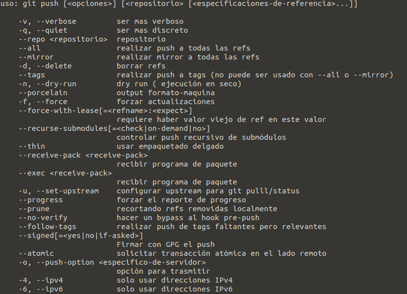

## GITHUB CONSOLA
_configurar git datos son iguales a los que se tiene en la  cuenta de github_
``` 
git config --global user.name "nombre_usuario"
git config --global user.email "email_id"
``` 
_Crea directorio para tu escritorio_
``` 
 > mkdir prueba
 > dir
``` 

_Creacion de Archivo Readme sirve para dar detalles del proyecto, programa o aplicación._
``` 
git init
touch README
git add README.md
```

_Realizar un commit se preparan los archivos con **git add .** significa que se anade todos los arhivos, para espeficicar archivos solo **git add  < nombre de archivo>.**
git **commit -m "Nombre_Commit"** guarda una copia del estado del archivo/s en ese momento y añade el código SHA a la cabecera del repositiorio_
``` 
git add .
git commit -m "Nombre_Commit"
 ```
 
_Empujar el contenido del repositorio local hacia el repositorio remoto, mediante el comando_
``` 
git push origin "Nombrerama"
``` 

_Crear rama_
```  
 git branch Unidad1
```

_Crea una rama a partir de donde estamos y con el estado de los archivos en el que nos encontramos pero no nos lleva a ella_
```
  git checkout Unidad1
``` 
  
_Crea una nueva rama en el repositorio, con los archivos en el estado en el que se encuentran en el momento que se crea y desde la rama en la que se crea y nos coloca en esa rama_

``` 
  git checkout -b otrarama
``` 


 


 _Borrar una rama de nuestro repositorio local_
 ```
  git branch -d "nombre_rama"
  git branch -D "nombre-rama"
``` 
_En el caso de querer eliminar una rama del repositorio remoto_
 ```
 git push origin "nombre-rama"
  ```




_Clona el repositiorio que haya en la url._
``` 
git clone <url>  
``` 
## Sincronización

_Baja el historial del repo remoto e incorpora los cambios. Es necesario hacer esto antes de subir nada._
``` 
 git pull
 ```
_Trae los cambios de la rama mencionada a la rama en la que nos encontramos_
``` 
  git merge Unidad1
  git merge Unidad2
  git merge Unidad3
``` 

  
  ### Referencias
- [markdown Github](https://docs.github.com/en/github/writing-on-github/basic-writing-and-formatting-syntax)
- [markdown Github](https://gist.github.com/Villanuevand/6386899f70346d4580c723232524d35a)
- [Comandos Git para consola](https://gist.github.com/mrcodedev/c234fd1aa2515008dd934ca8135cbfd2)

